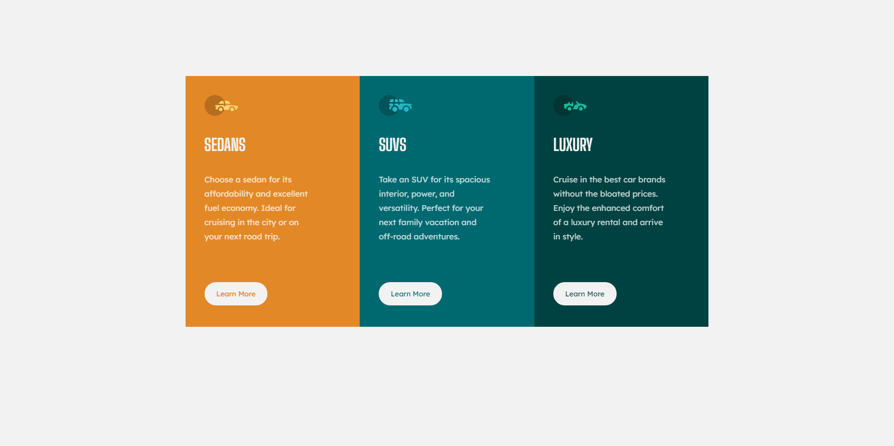

# Frontend Mentor - 3-Column Preview Card component solution
This is a solution to the [3-column preview card component challenge on Frontend Mentor](https://www.frontendmentor.io/challenges/3column-preview-card-component-pH92eAR2-).
Frontend Mentor challenges help you improve your coding skills by building realistic projects. 

### Built with
- Semantic HTML5 markup
- CSS custom properties
- Flexbox
- CSS Grid
- Mobile-first workflow
- SASS
- GULP

### Screenshot

### Links
- Live Site URL: [Link](https://suaferoantjk.github.io/3-Column-Preview-Card/)

## Author
- Frontend Mentor - [@SuaferoanTJK](https://www.frontendmentor.io/profile/SuaferoanTJK)
